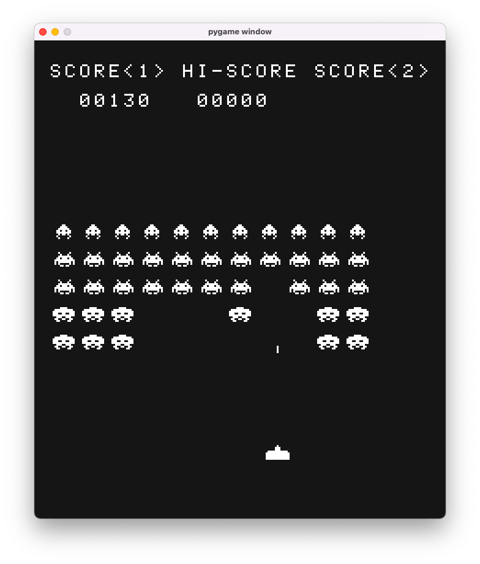
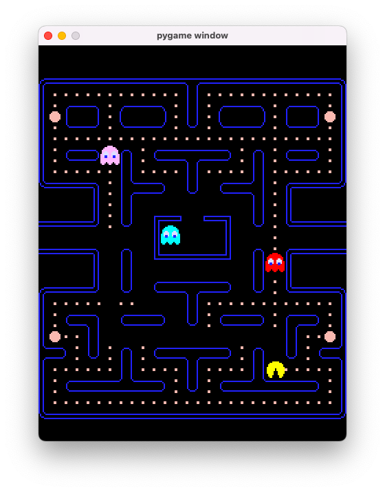
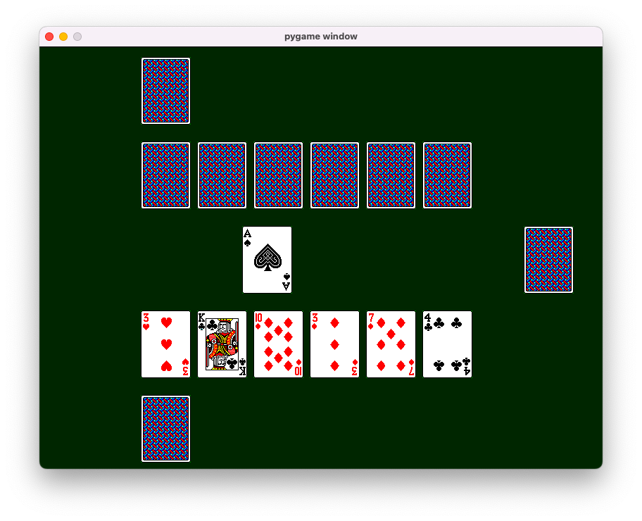
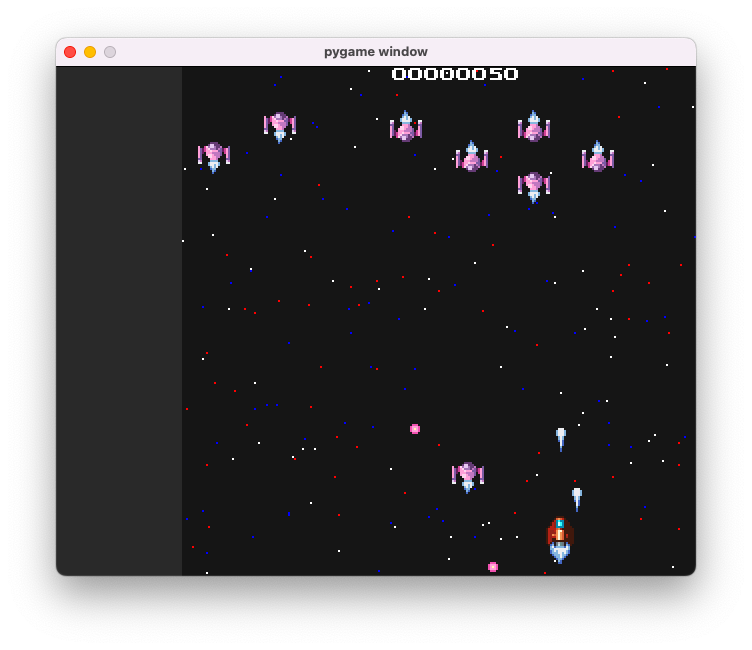
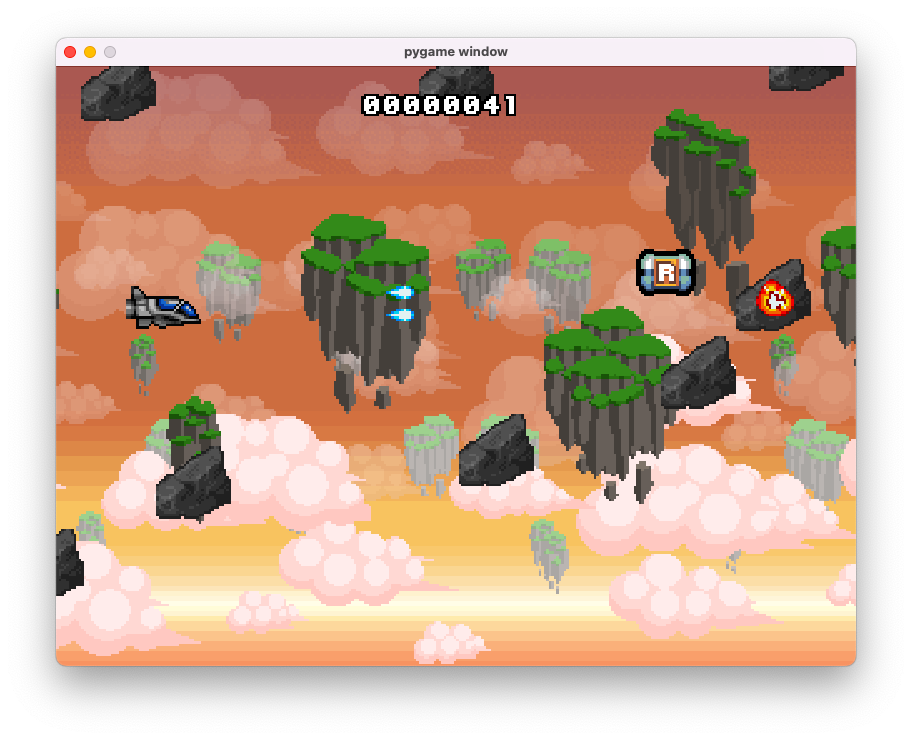
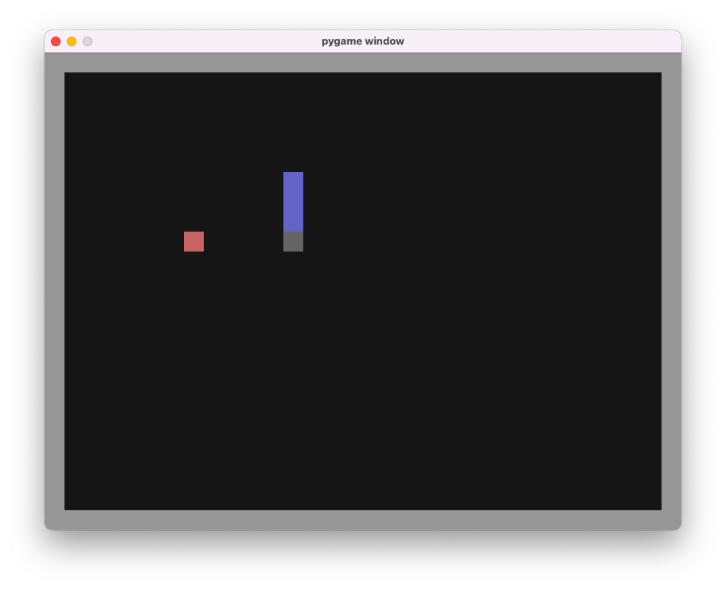

# Game collection

A work in progress for reviving some retro games in pygame.

## Games

### Space Invaders

#### Usage

Use arrow keys for navigation.

Press `Z` key for fire.

Press `Esc` key for exit.

#### TODO
- [ ] Implement bunkers.
- [ ] Implement "mystery ship".
- [ ] Implement shooting by aliens.
- [ ] Display lives and credit.

#### Credits

Sprites from [Spriters Resource](https://web.archive.org/web/20200622071728/https://www.spriters-resource.com/arcade/spaceinv/sheet/115520/)

### Pacman

#### Credits

Sprites from [Spriter Resources](https://web.archive.org/web/20210304222346/https://www.spriters-resource.com/arcade/pacman/)

Sounds from [ClassicGaming](https://web.archive.org/web/20211004132803/https://www.classicgaming.cc/classics/pac-man/sounds)

### Card game

#### About
This is a Greek card game called Ξερή (kseri)

It is similar to [Casino](https://en.wikipedia.org/wiki/Cassino_(card_game)) and [Bastra](https://en.wikipedia.org/wiki/Bastra) but there is not any exact variation for other countries.

#### Credits

Sprites from [Spriters Resource](https://web.archive.org/web/20220417063231/https://www.spriters-resource.com/pc_computer/solitaire/sheet/107016/)

### Galaga

#### Usage

Use arrow keys to navigate.

Press `X` key to shoot.

#### Credits

Sprites by [ansimuz](https://web.archive.org/web/20220425161230/http://ansimuz.com/site/portfolio/spaceship-shooter-environment/)

Fonts by [Zingot](https://web.archive.org/web/20210518182356/https://www.zingot.com/resources.html)

### Project-X

#### Usage

Use arrow keys to navigate.

Press `S` key to shoot.

Collect "P" power up to enchance weapons.

#### Credits

Backgrounds from [MGG](https://www.gamedevmarket.net/asset/pixelart-game-backgrounds/)

Sound effects by 8-Bit Retro Game SFX.

Music by [ansimuz](https://ansimuz.itch.io/warped-space-shooter)

Bonus items and fonts by [Superpowers Space Shooter Asset Pack](https://github.com/sparklinlabs/superpowers-asset-packs)

Project-X ripped sprites by [maVado](http://eab.abime.net/showthread.php?t=20428)

### Snake

